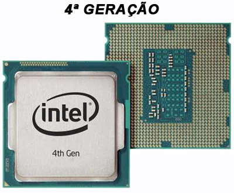

# MODELO DE ARTIGO/TCC

## POR FAVOR, LER O TEXTO DO MODELO, POIS CONTEM AS INSTRUÇÕES DE COMO ESCREVER O ARTIGO

## O modelo já está formatado, apenas remova as linhas de orientação de desenvolvimento

Centro Paula Souza 
Etec Vasco Antonio Venchiarutti – Jundiaí - SP   
Técnico em XXXXX – mmm/2099 

Artigo desenvolvido na disciplina de DDDDDDDDD sob orientação dos professores XXXXX e YYYY.

O título deve ser claro e objetivo.  
NÃO DEVE SER ALTERADO DURANTE A EXECUÇÃO DO PROJETO.  
Ele deve ser definido com o auxílio do ORIENTADOR.

TÍTULO DO ARTIGO: Sub-Título, Se Houver

(MÁXIMO DUAS LINHAS – Times New Roman 14), o restante do texto usar tamanho 12 e espaço entre linhas de 1,5cm, texto justificado, recuo na primeira linha, 1,25cm.

Aluno A 
Dino da Silva Sauro 
Aluno C

Colocar o nome completo sem abreviar  
Colocar os nomes EM ORDEM ALFABÉTICA  

---

## RESUMO

Este estudo tem o objetivo de analisar (inserir o texto do objetivo). Dentre os autores pesquisados para a constituição conceitual deste trabalho, destacaram-se (SOMENTE O SOBRENOME DO AUTOR DAS FONTES CONSULTADA, Somente a primeira letra do sobrenome em maiúsculo.) Autor (ano), Autor (ano), Autor (ano). A metodologia utilizada foi a pesquisa (exploratória ou descritiva ou explicativa), tendo como coleta de dados o levantamento bibliográfico (se for o caso, acrescentar: estudo de caso, relato de experiência ou pesquisa de campo). As conclusões mais relevantes são (inserir as principais conclusões).

Palavras-chave: Palavra 1. Palavra 2. Palavra 3.  

(listar de 3 a 5 palavras que remetam ao conteúdo do trabalho, separadas entre si por ponto e finalizadas por ponto, Sempre do mais genérico para o mais específico. Por exemplo: Palavras-chave: Sistema Solar. Sol. Coroa Solar.)

OBS: O texto do artigo deve ser corrido, não tem índice, lista ou sumário.

---

## INTRODUÇÃO (NÃO MUDAR ESTE TÍTULO)

A introdução deve ter somente estes 5 parágrafos, abaixo.

Neste parágrafo deve-se expor a contextualização do tema, apresentando as circunstâncias/problema/questão e o contexto do tema escolhido de forma fundamentada em teóricos.

O presente estudo delimita-se a (na delimitação do trabalho, cite de modo claro, objetivo e preciso o tema do trabalho, indicando o ponto de vista sob o qual será enfocado no seu desenvolvimento. Na escolha do tema é necessário eleger uma parcela delimitada de um assunto, estabelecendo limites para o desenvolvimento da pesquisa pretendida. Ele deve ser suficientemente limitado para que seja realizável com os recursos e tempo disponíveis);

O objetivo geral é (deve inserir a escrita do objetivo geral, sempre iniciando com um verbo no infinitivo [analisar/investigar/compreender/discutir/avaliar]); 

Esta pesquisa justifica-se (na justificativa acadêmica e social da escolha do tema deve explicar as razões de ordem teórica que levaram o autor do trabalho a estudar o tema escolhido e não outro qualquer, ou o que torna importante a realização do mesmo. Portanto, deve-se mostrar a importância e a relevância do estudo da temática para a ciência. Deve-se mostrar também qual a contribuição que o estudo realizado pretende proporcionar);
 

A metodologia deste trabalho é a pesquisa (exploratória ou descritiva ou explicativa), tendo como coleta de dados o levantamento bibliográfico (e, se for o caso: questionário / entrevista / observação).
  

---

## DESENVOLVIMENTO DO REFERENCIAL TEÓRICO (Título do bloco de texto)

Criar um Título para cada bloco de texto que trate de assuntos diferentes, mas relacionados. O Título deve em caixa alta e não deve ser numerado.

O Referencial teórico apresenta as bases teóricas pesquisadas e que sustentarão a proposta do trabalho. Ela deve ser coerente ao título do artigo. Ela é composta de: texto, fotos, tabelas, gráficos e quadros que devem ser referenciados no texto. Cada um destes elementos deve ser explicado com detalhes em um texto antes deles.

Deve-se ter muito cuidado com as citações, que tem por objetivo formar um referencial teórico em embasar a proposta ou dissertação do aluno. Procure usar citação direta (curta e longa) e indireta.

A falta de citação caracteriza plágio.

### Exemplo de citação indireta:

As necessidades do mercado trabalhista exigem do educando uma educação continuada... (PEREIRA, 2007).

### Exemplo de citação direta curta:

Os livros, primeiramente foram “elaborados em papiro”, relata Tajra (2012).  
"O desenvolvimento do papiro deu-se em 2200 a.C..." (CALDEIRA, 2002).

### Exemplo de citação direta longa:

>
No final da Idade Média, a importância do papel cresceu com a expansão do comércio europeu e tornou-se produto essencial para a administração pública e para a divulgação literária.

>
Johann Gutenberg inventou o processo de impressão com caracteres móveis - a tipografia. Nascido, em 1397, da cidade de Mogúncia, Alemanha, trabalhava na Casa da Moeda onde aprendeu a arte de trabalhos em metal. Em 1428, Gutenberg parte para Estrasburgo, onde fez as primeiras tentativas de impressão. Segundo dados históricos, em 1442, foi impresso o primeiro exemplar em uma prensa. Em 1448 volta à sua cidade natal, e dá início a uma sociedade comercial com Johann Fust e fundam a 'Fábrica de Livros' - nome original Werk der Buchei. Entre as produções está a conhecida Bíblia de Gutenberg de 42 linhas (CALDEIRA, 2002, p.2).

---

Use o caracter ">" no início do parágrafo para fazer citação em Markdown

Para a construção do trabalho devem ser utilizados sites acadêmicos confiáveis.

Não utilizar Wikipédia, blogs, fóruns, etc.

A linguagem científica deve ser objetiva e impessoal.

---

### Figuras

Figura 7: Processador Intel I3, 4ª Geração   
 
Fonte: Atera Informática  

---

O texto deve ser corrido, sem mudança de página.

Palavras estrangeiras devem ser em *itálico*.

---

## TÍTULO RELACIONADO A PARTE DO QUE FOI (Título do bloco de texto)

Descrever o conteúdo utilizando texto e elementos visuais.

---

## DISCUSSÕES E RESULTADOS (NÃO MUDAR ESTE TÍTULO)

Demonstrar que os objetivos foram atingidos.

---

## CONSIDERAÇÕES FINAIS (NÃO MUDAR ESTE TÍTULO)

- Resumo do trabalho  
- Resultados obtidos  
- Sugestões futuras  

---

## REFERÊNCIAS (NÃO MUDAR ESTE TÍTULO)

CALDEIRA, C. Do papiro ao papel manufaturado. 2002.  
Disponível em: <http://www.usp.br/...>  

PEREIRA, J. G. O Novo Perfil Profissional. 2007.  
Disponível em <http://www.rhportal.com.br/...>  

TAJRA, S. F. Informática na Educação. São Paulo: Érica, 2012.